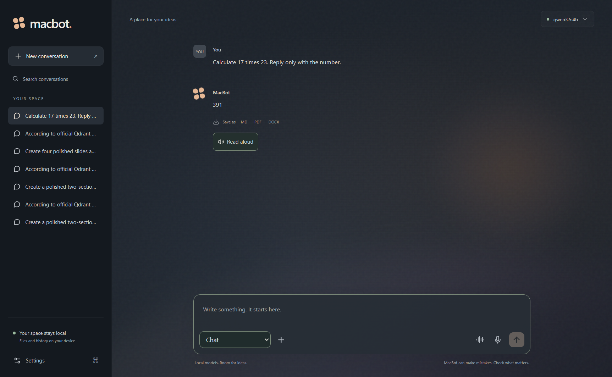

# MacBot

A local creative workspace for your questions, files and ideas.

[Get started](#first-play) · [What you can create](#make-something) · [Your privacy](PRIVACY.md)



Chat, explore attachments, research a question, or create something you can save. MacBot runs AI models on your device, with no paid model API or required account. Its original, relaxed personality takes creative inspiration from Mac Miller.

## First play

Extract **release/MacBot-0.2.1-Windows-Portable.zip** and open **MacBot.exe** inside the **MacBot-Portable** folder. You see only the executable and one **MacBot** support folder. There is no installer. Keep them together.

The portable download contains MacBot and a small preparation tool. On first launch, a preparation screen downloads and verifies the local AI engines, libraries and all six essential models before opening the workspace. It shows download progress, with pause, resume and retry controls. Compatible existing model caches are verified and reused. Later launches reuse the prepared files.

MacBot checks existing Ollama and Hugging Face model caches and reuses files that match its pinned versions and checksums. It copies them into its own folder, preserving portability and leaving other installations intact. Compatible existing Python, Node and Ollama files and public package caches are checked before downloading; verified files are copied into the portable folder. Unrelated system Python libraries are not mixed into the app.

You need internet access and several GB of free space; allow around 16 GB for the prepared app, downloaded models and temporary downloads. After preparation, local chat and creation work offline.

Conversations, attachments, models and generated files stay in **MacBot/Data**. Move or back up the whole folder to keep your workspace. MCP credentials use Windows protection and must be entered again when moving to another Windows account.

Python, Node, Ollama and AI libraries are prepared directly from their publishers into **MacBot/runtime**. They run privately without a system installation or administrator access. The initial folder is small; the prepared workspace still needs those engines and model files. MacBot is built for Windows PCs (x64) and needs the system [WebView2 runtime](https://learn.microsoft.com/en-us/microsoft-edge/webview2/). Tauri uses this system browser engine, which is based on Chromium. Keep the **MacBot** support folder with the executable after preparation.

Download **MacBot-0.2.1-Windows-Portable.zip** from Releases. It is the only app download; there is no separate engine package or setup executable. First preparation requires internet access. For a new app version, extract it into a fresh folder and copy your **MacBot/Data** folder across.

## Make something

Choose a task beside the message box, or directly ask MacBot to create a file.

| Task | What you can do |
| --- | --- |
| Chat | Ask questions and explore attached files. |
| Deep Research | Search the web and receive supported claims with sources and excerpts. |
| Create image | Describe a subject, style, dimensions, aspect ratio and filter. Save PNG, JPEG or WebP. |
| Create audio | Write and record a short English spoken script as WAV. |
| Create document | Request styled Word documents, PDFs or both, with sections, tables, page size and orientation. |
| Create spreadsheet | Request XLSX workbooks with formatted data, colours, currency or percentage formats and charts. |
| Create slides | Request themed PPTX decks with covers, comparisons, timelines, metrics, attached images and speaker notes. |
| Connected tools | Review and approve the exact arguments before calling a connected MCP tool. |

Describe the result you want: "Create a purple and cream proposal as Word and PDF" or "Generate a 1024x576 cinematic image in WebP." Image exports support 128-2048 pixels per dimension. The lightweight model renders at up to 512 pixels on its longest edge, then crops and resizes for export; larger files do not gain native detail. Generation can take several minutes on CPU.

Assistant replies can also be saved as Markdown, Word or PDF. **Read aloud** records an existing reply with the local English voice. Audio creation makes speech with a separate synthetic voice.

## Bring your files

Attach PDFs, Word documents, spreadsheets, presentations, text, code, images, audio or video. Microphone dictation and audio transcription produce an editable draft before sending.

Google's [EmbeddingGemma 2](https://developers.googleblog.com/en/embeddinggemma-2-the-developer-guide/) searches text, images, audio and sampled video frames. OCR reads images and scanned pages. Attachments remain available within their conversation.

Uploads support 20 MB each and five files per message. Audio supports ten minutes and video five minutes. Video analysis samples frames; OCR and transcription can miss details. Search retrieves relevant portions of long files. Imported spreadsheet formulas are preserved but not calculated; generated formulas are saved as text for safety.

## Connect your tools

In **Settings**, add a remote Streamable HTTP URL or a local MCP command and arguments. You can also import a standard MCP configuration. Browse public servers in the [MCP directory](https://github.com/mcp), then follow that provider's configuration instructions.

Review and explicitly trust a connection before inspecting or enabling it. Local Python, Node and npx commands can use the included runtimes; servers with other dependencies still need them. A first local connection can download its dependencies and may take up to two minutes. Remote servers can use configured authentication headers. Browser-based OAuth setup and legacy SSE are not included. Built-in workspace tools operate inside MacBot's workspace folder.

Public servers are third-party software. Trusting a local server lets its program run with your Windows user's permissions; approval of individual tool calls does not sandbox that program.

## Your space

**Settings / Your data & privacy** shows the data folder and lets you delete a conversation or erase your personal workspace while keeping public models. MacBot has no analytics or automatic conversation uploads. Local history is not encrypted. Deep Research sends searches to a search provider; external tools receive the arguments you approve. See the [privacy notice](PRIVACY.md).

Qwen3.5 4B is the default chat and vision model for a 4 GB GPU and 16 GB RAM. Separate local engines handle search, images, speech and evidence checks. Larger models are available in Settings and require more memory. Heavy tasks run one at a time.

An optional style adapter can be trained from original examples or your own JSONL data. It is disabled by default. The tested CPU training path uses PEFT LoRA; Unsloth remains an optional separate GPU training environment. Preservation checks do not prove that an adapter sounds like Mac Miller.

Research can abstain when evidence is insufficient and still needs source review. Generated content needs review before use. The Windows executable is unsigned. Downloaded components retain their own licenses and notices; share the clean portable ZIP rather than your prepared workspace.

## Build your own portable

The repository contains the source and build inputs. To create the Windows portable yourself, use Node.js 22 or newer, Python 3.11, uv 0.12.21, Rust with the MSVC toolchain, and Visual Studio 2022 Build Tools with Desktop development with C++ and the Windows SDK. Run these commands from the repository folder in PowerShell:

```powershell
npm ci
uv sync --locked --directory backend --extra dev --python 3.11
npm run build:desktop
backend/.venv/Scripts/python.exe scripts/package-portable.py
```

The result is **release/MacBot-0.2.1-Windows-Portable.zip**. Upload that ZIP as the download in a GitHub Release. Keep generated files, prepared models and personal workspace data out of the source repository; they are excluded by `.gitignore`.
